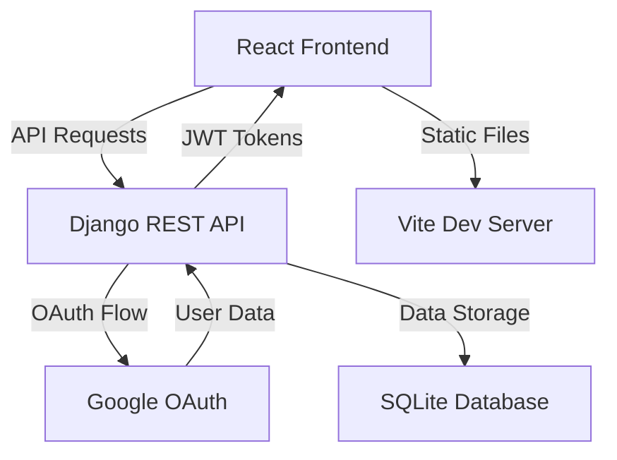

# 🔐 Google Authentication with Django & React

A full-stack web application demonstrating secure authentication using Google OAuth2, Django REST Framework, and React.


## ✨ Features

### 🔐 Authentication & Security

- **Multiple Login Options**: Traditional username/password and Google OAuth 2.0
- **JWT Token Management**: Secure token-based authentication with automatic refresh
- **Protected Routes**: Client-side route protection with seamless redirects
- **Session Management**: Persistent login state across browser sessions

### 💻 Modern Tech Stack

- **Frontend**: React 19 with Tailwind CSS 4 for responsive, modern UI
- **Backend**: Django 5.2 with Django REST Framework for robust API
- **Database**: SQLite for development (easily configurable for production)
- **Build Tools**: Vite for lightning-fast development and optimized builds

### 🎨 User Experience

- **Responsive Design**: Mobile-first approach with seamless device compatibility
- **Smooth Animations**: Framer Motion integration for polished interactions
- **Loading States**: Comprehensive loading and error state management
- **Intuitive Navigation**: Clean, modern interface with clear user feedback

## 🏗️ Architecture



## 🛠️ Technology Stack

### 🖥️ Frontend

- ⚛️ React 19
- 🎨 Tailwind CSS 4
- 🧭 React Router v7
- ✨ Framer Motion (animations)
- 📡 Axios (API requests)
- 🛠️ @react-oauth/google (Google OAuth integration)
- ⚡ Vite (build tool)

### 🗄️ Backend

- 🐍 Django 5.2
- 🌐 Django REST Framework
- 🔑 dj-rest-auth & django-allauth (OAuth handling)
- 🔒 Simple JWT (JWT authentication)
- 🗃️ SQLite (database)

## 🚀 Quick Start

Get the application running in under 5 minutes:

```bash
# Clone the repository
git clone https://github.com/kevinThulnith/google-authentication.git
cd google-auth-system

# Backend setup
cd backend
python -m venv .venv
source .venv/bin/activate  # On Windows: .venv\Scripts\activate
pip install -e .
python manage.py migrate
python manage.py runserver

# Frontend setup (in a new terminal)
cd frontend
npm i
npm run dev
```

## 📋 Prerequisites

Ensure you have the following installed on your system:

- 🐍 **Python 3.13+** - [Download Python](https://python.org/downloads/)
- 📦 **Node.js 18+** - [Download Node.js](https://nodejs.org/)
- 🐙 **Git** - [Download Git](https://git-scm.com/)
- ☁️ **Google Cloud Account** - For OAuth credentials

## ⚙️ Installation

### 🔧 Backend Setup

1. **Create and activate virtual environment**:

   ```bash
   cd backend

   # create venv with dependencies
   uv sync

   # On Windows
   .venv\Scripts\activate

   # On macOS/Linux
   source .venv/bin/activate
   ```

2. **Configure environment variables**:

   ```bash
   # Create .env file in backend directory
   touch .env  # On Windows: type nul > .env
   ```

   Add the following to your `.env` file:

   ```env
   SECRET_KEY=your-super-secret-django-key-here
   GOOGLE_CLIENT_ID=your-google-client-id
   GOOGLE_CLIENT_SECRET=your-google-client-secret
   ```

3. **Set up database**:

   ```bash
   python manage.py migrate
   python manage.py createsuperuser  # Optional: for admin access
   ```

4. **Start the development server**:

   ```bash
   python manage.py runserver
   ```

### 💻 Frontend Setup

1. **Navigate to frontend directory**:

   ```bash
   cd frontend
   ```

2. **Install dependencies**:

   ```bash
   npm i
   ```

3. **Configure environment variables**:

   ```bash
   # Create .env file in frontend directory
   touch .env  # On Windows: type nul > .env
   ```

   Add the following to your `.env` file:

   ```env
   VITE_API_URL=http://localhost:8000
   VITE_GOOGLE_CLIENT_ID=your-google-client-id
   ```

4. **Start the development server**:

   ```bash
   npm run dev
   ```

## 🔧 Configuration

### Environment Variables Reference

#### Backend Variables

| Variable               | Description                                 | Required | Default     |
| ---------------------- | ------------------------------------------- | -------- | ----------- |
| `SECRET_KEY`           | Django secret key for cryptographic signing | ✅       | -           |
| `DEBUG`                | Enable Django debug mode                    | ❌       | `False`     |
| `GOOGLE_CLIENT_ID`     | Google OAuth client identifier              | ✅       | -           |
| `GOOGLE_CLIENT_SECRET` | Google OAuth client secret                  | ✅       | -           |
| `ALLOWED_HOSTS`        | Comma-separated list of allowed hosts       | ❌       | `localhost` |

#### Frontend Variables

| Variable                | Description                    | Required | Default |
| ----------------------- | ------------------------------ | -------- | ------- |
| `VITE_API_URL`          | Backend API base URL           | ✅       | -       |
| `VITE_GOOGLE_CLIENT_ID` | Google OAuth client identifier | ✅       | -       |

## 🌐 Google OAuth Setup

Follow these steps to set up Google OAuth integration:

### Step 1: Create Google Cloud Project

1. Visit the [Google Cloud Console](https://console.cloud.google.com/)
2. Click "New Project" and provide a project name
3. Select your newly created project

### Step 2: Enable APIs

1. Navigate to **APIs & Services** → **Library**
2. Search for and enable:
   - Google+ API
   - Google OAuth2 API

### Step 3: Configure OAuth Consent Screen

1. Go to **APIs & Services** → **OAuth consent screen**
2. Choose **External** user type
3. Fill in required fields:
   - App name
   - User support email
   - Developer contact information

### Step 4: Create OAuth Credentials

1. Navigate to **APIs & Services** → **Credentials**
2. Click **Create Credentials** → **OAuth client ID**
3. Choose **Web application**
4. Configure the following:
   - **Authorized JavaScript origins**:
     - `http://localhost:5173` (development)
     - `https://yourdomain.com` (production)
   - **Authorized redirect URIs**:
     - `http://localhost:5173` (development)
     - `https://yourdomain.com` (production)

### Step 5: Save Credentials

Copy the **Client ID** and **Client Secret** to your environment files.

## 📁 Project Structure

```sh
google-auth-system/
├── 📁 backend/                 # Django backend application
│   ├── 📁 api/                # Main API application
│   │   ├── 📄 views.py        # API endpoint implementations
│   │   ├── 📄 urls.py         # URL routing configuration
│   │   ├── 📄 serializers.py  # Data serialization logic
│   │   └── 📄 models.py       # Database models (if any)
│   ├── 📁 backend/            # Django project settings
│   │   ├── 📄 settings.py     # Main configuration file
│   │   ├── 📄 urls.py         # Root URL configuration
│   │   └── 📄 wsgi.py         # WSGI configuration
│   ├── 📄 manage.py           # Django management script
│   └── 📄 .env               # Backend environment variables
├── 📁 frontend/               # React frontend application
│   ├── 📁 public/            # Static assets
│   │   └── 🖼️ logo.png        # Application logo
│   ├── 📁 src/               # Source code
│   │   ├── 📁 components/    # Reusable React components
│   │   ├── 📁 pages/         # Page-level components
│   │   ├── 📄 api.js         # API client configuration
│   │   ├── 📄 App.jsx        # Main application component
│   │   └── 📄 main.jsx       # Application entry point
│   ├── 📄 package.json       # Node.js dependencies
│   ├── 📄 vite.config.js     # Vite configuration
│   └── 📄 .env              # Frontend environment variables
├── 📄 README.md              # Project documentation
├── 📄 pyproject.toml         # Python project configuration
└── 📄 LICENSE               # MIT license file
```

## 🤝 Contributing

We welcome contributions! Please follow these steps:

1. **Fork the repository**
2. **Create a feature branch**: `git checkout -b feature/amazing-feature`
3. **Commit your changes**: `git commit -m 'Add some amazing feature'`
4. **Push to the branch**: `git push origin feature/amazing-feature`
5. **Open a Pull Request**

### Development Guidelines

- Follow PEP 8 for Python code
- Use ESLint configuration for JavaScript/React
- Write tests for new features
- Update documentation as needed

## 📄 License

This project is licensed under the MIT License - see the [LICENSE](LICENSE) file for details.

## 🙏 Acknowledgments

- [Django REST Framework](https://www.django-rest-framework.org/) for the powerful API framework
- [React](https://reactjs.org/) for the frontend framework
- [Tailwind CSS](https://tailwindcss.com/) for the utility-first CSS framework
- [Google OAuth](https://developers.google.com/identity/protocols/oauth2) for authentication services

---

<div align="center">
  Made with ❤️ by Kevin Thulnith
</div>
